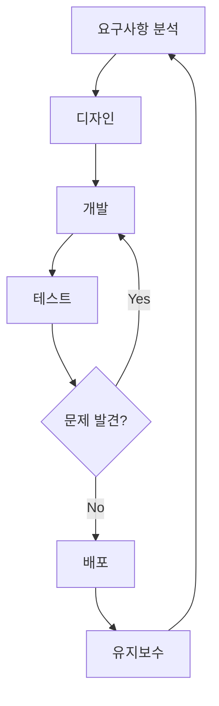

## 웹 개발자를 위한 10가지 필수 팁

웹 개발은 끊임없이 변화하는 분야입니다. 새로운 기술, 프레임워크, 라이브러리가 계속해서 등장하고 있죠. 이런 환경에서 웹 개발자로 성장하기 위해 알아두면 좋은 10가지 팁을 소개합니다.

### 1. 기본에 충실하기

HTML, CSS, JavaScript의 기본을 확실히 이해하는 것이 중요합니다. 프레임워크와 라이브러리는 계속 변하지만, 기본은 변하지 않습니다.

```html
<!-- 시맨틱 HTML의 예시 -->
<header>
  <h1>웹사이트 제목</h1>
  <nav>
    <ul>
      <li><a href="#home">홈</a></li>
      <li><a href="#about">소개</a></li>
      <li><a href="#contact">연락처</a></li>
    </ul>
  </nav>
</header>
<main>
  <article>
    <h2>기사 제목</h2>
    <p>기사 내용...</p>
  </article>
</main>
<footer>
  <p>&copy; 2025 내 웹사이트</p>
</footer>
```

### 2. 반응형 디자인 마스터하기

모바일 기기의 사용이 증가함에 따라 반응형 디자인은 필수가 되었습니다. 미디어 쿼리와 유연한 그리드 시스템을 활용하세요.

```css
/* 기본 스타일 (모바일 우선) */
.container {
  width: 100%;
  padding: 15px;
}

/* 태블릿 */
@media (min-width: 768px) {
  .container {
    width: 750px;
    margin: 0 auto;
  }
}

/* 데스크톱 */
@media (min-width: 1024px) {
  .container {
    width: 970px;
  }
}
```

### 3. 성능 최적화하기

웹사이트의 성능은 사용자 경험과 SEO에 큰 영향을 미칩니다. 이미지 최적화, 코드 분할, 지연 로딩 등의 기술을 활용하세요.

### 4. 접근성 고려하기

모든 사용자가 웹사이트를 이용할 수 있도록 접근성을 고려해야 합니다. ARIA 속성, 키보드 네비게이션, 적절한 색상 대비 등을 신경 쓰세요.

### 5. 버전 관리 시스템 사용하기

Git과 같은 버전 관리 시스템은 코드 변경 사항을 추적하고 팀과 협업하는 데 필수적입니다.

```bash
# Git 기본 명령어
git init
git add .
git commit -m "초기 커밋"
git push origin main
```

### 6. 테스트 습관화하기

단위 테스트, 통합 테스트, E2E 테스트 등 다양한 테스트를 통해 코드의 품질을 유지하세요.

```javascript
// Jest를 사용한 단위 테스트 예시
test('두 숫자의 합을 반환한다', () => {
  expect(sum(1, 2)).toBe(3);
  expect(sum(-1, 1)).toBe(0);
  expect(sum(0, 0)).toBe(0);
});
```

### 7. 지속적인 학습

웹 개발 분야는 빠르게 변화합니다. 블로그, 팟캐스트, 컨퍼런스 등을 통해 최신 트렌드를 파악하고 계속해서 학습하세요.

### 8. 보안 의식 갖기

XSS, CSRF, SQL 인젝션 등의 보안 취약점을 이해하고 방어하는 방법을 알아두세요.

```javascript
// XSS 방어를 위한 텍스트 이스케이프 함수
function escapeHTML(text) {
  return text
    .replace(/&/g, '&amp;')
    .replace(/</g, '&lt;')
    .replace(/>/g, '&gt;')
    .replace(/"/g, '&quot;')
    .replace(/'/g, '&#039;');
}
```

### 9. 개발 워크플로우 자동화

Webpack, Gulp, npm 스크립트 등을 활용하여 반복적인 작업을 자동화하세요.

### 10. 사용자 중심 사고

최종적으로 가장 중요한 것은 사용자입니다. 사용자의 니즈와 경험을 항상 최우선으로 생각하세요.

## 개발 프로세스 다이어그램

아래는 효율적인 웹 개발 프로세스를 보여주는 다이어그램입니다:



## 마무리

이 팁들이 여러분의 웹 개발 여정에 도움이 되길 바랍니다. 웹 개발은 끊임없는 학습과 실험의 과정입니다. 실패를 두려워하지 말고 계속해서 도전하세요!

질문이나 의견이 있으시면 댓글로 남겨주세요. 다음 포스팅에서는 프론트엔드 프레임워크 비교에 대해 다루겠습니다.